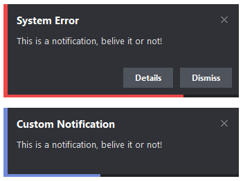
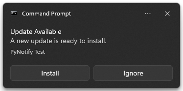

# PyNotify

A library designed for Windows (with planned linux support), that allows you to create every type of standard desktop notification!

<h2 cstyle="text-align: center;"><bold>Created by Nerd Bear</bold></h2>

Disclaimer: Even though the code is made by humans, certain docstrings were created by AI VSC extensions.